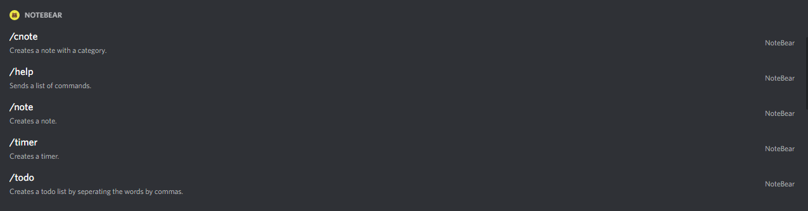

# NoteBear
NoteBear is a Discord bot that allows rapid creation of timers, todo lists, notes, and notes with categories.

## Use
NoteBear has five commands.

The first command is help, this sends a list of all the commands and what they do.

The second command is /note, this sends a note to the user.

The third command is /cnote, this sends a note to the user with a category and the option to give it a color.

The fourth command is /timer, this sends the user an alert when the timer for the given time is done.

The fifth command is /todo, this sends the user a todo list.

## Privacy
Every command cannot be seen by anyone else and everything will be sent through direct messages.

